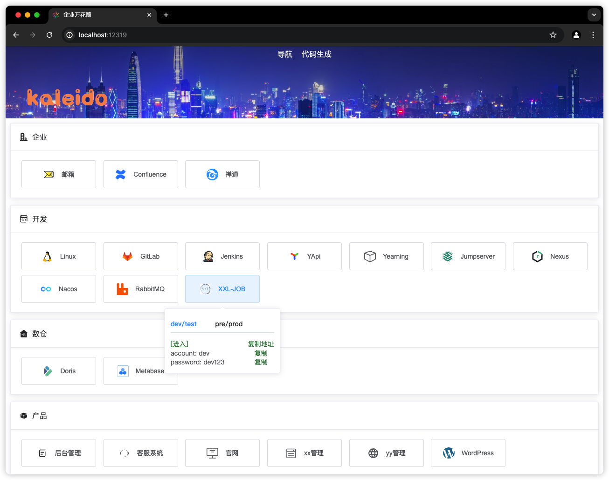
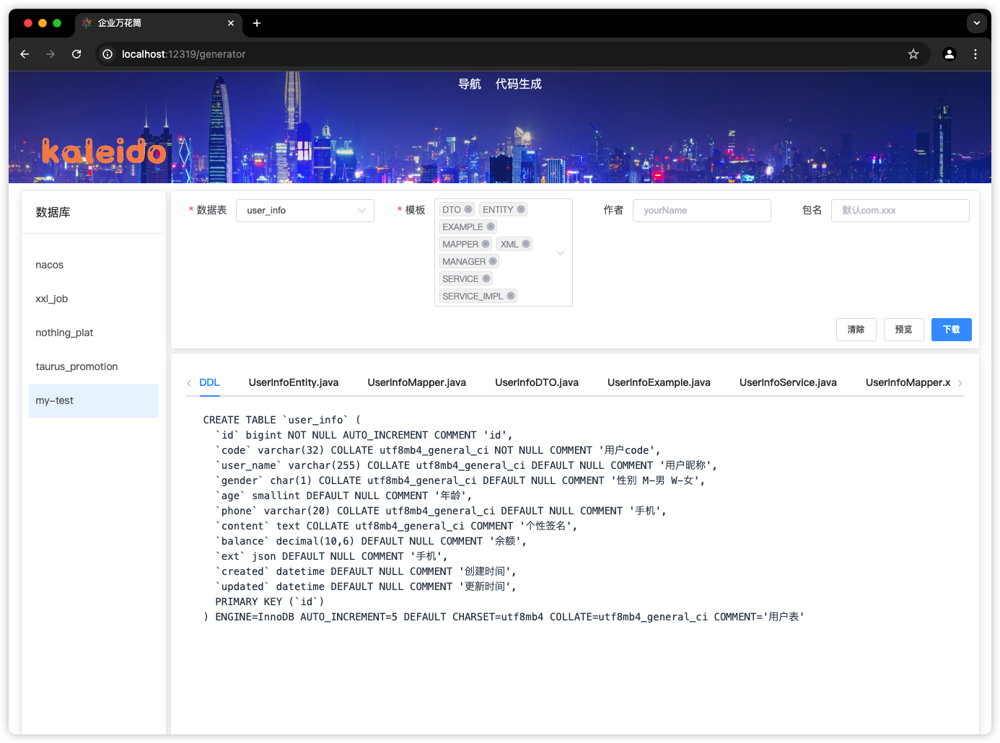

# 1 企业万花筒

## 1.1 企业导航系统

图一



图二



## 1.2 功能

1. 采用H2作为企业网址的数据存储，通过DBeaber、Navicat等管理工具对导航页进行更新。
2. 规范企业代码生成。连接MySQL通过Mybatis-plus生成代码，通过编写适合的模板。
3. 页面采用vue2，打包进SpringBoot服务启动。

# 2 安装

> 前置条件
> 1. node16
> 2. jdk8

```bash
cd everything-kaleidoscope
chmod +x install.sh
./install.sh
```
生成release，如下
```txt
release
 ├── everything-kaleido.jar
 ├── templates
 │   ├── serviceImpl.java.vm
 │   ├── example.java.vm
 │   ├── manager.java.vm
 │   ├── mapper.java.vm
 │   ├── service.java.vm
 │   ├── dto.java.vm
 │   ├── entity.java.vm
 │   └── mapper.xml.vm
 └── start.sh
```

指定start.sh中的MySQL连接，代码生成功能将会通过连接获取数据库元数据。

> 建议指定为开发环境MySQL

# 3 部署

## 3.1 原生部署

```bash
cd ./release
chmod +x start.sh
./start.sh
```

启动后会在目录下生成h2文件夹。

> 访问地址：localhost:12319
> 
> 注意：此时打开首页无数据，需要通过数据库连接工具导入，查看【4 导航数据维护】

## 3.2 docker部署

1.构建镜像
```bash
cd everything-kaleidoscope
docker build -t everything-kaleido:1.0 .
```

2.启动容器
```bash
docker run -d \
  -p 12319:123119 \
  -p 11111:11111 \
  -e MYSQL_URL=localhost:3306 \
  -e MYSQL_ACCOUNT=root \
  -e MYSQL_PASSWORD=123456 \
  -v /home/lgl/test/h2:/opt/app/h2 \
  -v /home/lgl/test/templates:/opt/app/templates \
  -v /home/lgl/test/logs:/opt/app/logs \
  --network my-network \
  --name kaleido \
  everything-kaleido:1.0
```

## 3.3 docker-compose部署

1.构建镜像
```bash
cd everything-kaleidoscope
docker build -t everything-kaleido:1.0 .
```

2.启动容器
```yaml
version: '3'
services:
  kaleido:
    image: everything-kaleido:1.0
    container_name: kaleido
    ports:
      - 12319:12319
      - 11111:11111
    environment:
      MYSQL_URL: localhost:3306
      MYSQL_ACCOUNT: root
      MYSQL_PASSWORD: 123456
    volumes:
      - ./h2:/opt/app/h2
      - ./templates:/opt/app/templates
      - ./logs:/opt/app/logs
    tty: true
    stdin_open: true
    privileged: true
    # restart: always
```

# 4 导航数据维护

1.通过数据库工具连接内嵌H2
```txt
# xxx为everything-kaleido所在目录
url: jdbc:h2:tcp://localhost:11111/file://xxx/release/h2/h2db;AUTO_SERVER=TRUE;AUTO_RECONNECT=TRUE;MODE=MySQL;DATABASE_TO_LOWER=TRUE
username: sa
password: 123456
```
public模式下，有一个kaleido_scope空表。

2.导入数据

按实际情况调整everything-kaleido/init/dml.sql下的初始化脚本，并导入kaleido_scope。

# 5 环境变量及默认值

```txt
# SpringBoot服务端口
PORT=12319

# SpringBoot内嵌数据库
H2_PATH=./h2/h2db
H2_PORT=11111
H2_PASSWORD=123456

# 代码生成数据库
MYSQL_URL=mysql:3306
MYSQL_ACCOUNT=dev
MYSQL_PASSWORD=123456

# 模板路径
TEMPLATE_PATH=./templates

# docker部署的jvm参数
JAVA_OPTIONS=
```

